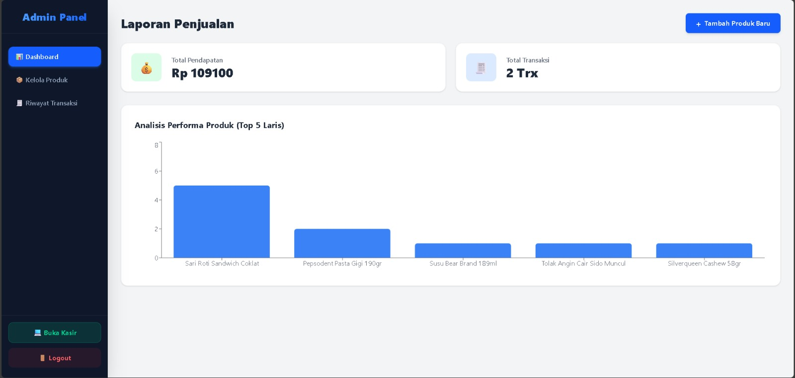
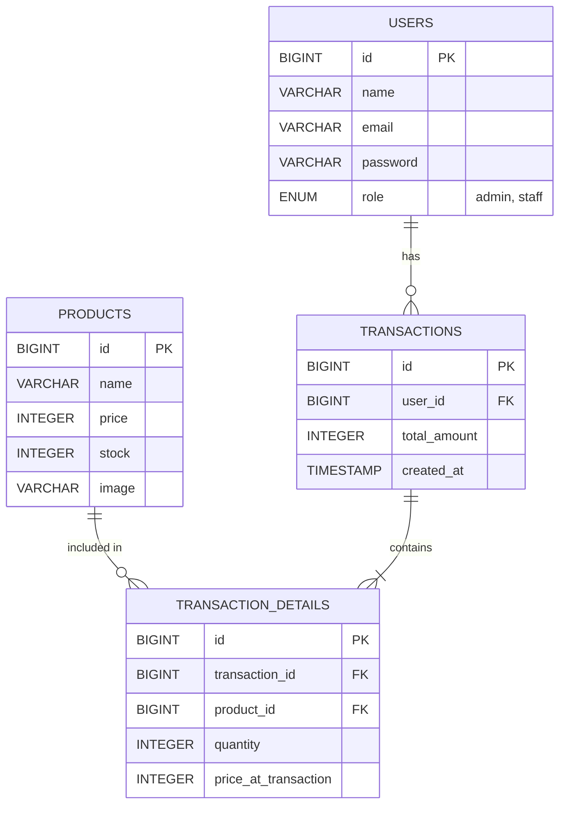

# Venta POS - Point of Sales & Inventory Management

Venta POS adalah project _fullstack web application_ untuk manajemen kasir dan inventori barang. Aplikasi ini dibangun menggunakan arsitektur pemisahan antara backend (REST API) dan frontend, dirancang khusus untuk memenuhi studi kasus minimarket atau toko ritel modern.

Project ini dibuat sebagai Final Project / Portofolio untuk mendemonstrasikan integrasi antara framework Laravel dan React.js.

## Fitur Aplikasi

**Halaman Kasir (Frontend)**

- Katalog produk interaktif dengan fitur pengecekan stok otomatis (tidak bisa menambah barang jika stok habis).
- Mendukung metode pembayaran: Tunai (dengan kalkulasi kembalian otomatis), QRIS, dan Kartu Debit.
- Generate struk belanja digital yang otomatis menyesuaikan format kertas printer kasir (_print-ready_).

**Panel Admin (Backoffice)**

- **Dashboard & Analitik:** Ringkasan pendapatan, total transaksi, dan grafik bar (Top 5 Produk Laris).
- **Smart Stock Alert:** Notifikasi langsung di dashboard untuk barang yang stoknya menipis (di bawah 15 pcs).
- **Kelola Produk:** Fitur CRUD (Create, Read, Update, Delete) barang beserta fitur pencarian instan (_real-time search_).
- **Riwayat Transaksi:** Tabel rekapitulasi nota transaksi yang berhasil, lengkap dengan detail waktu dan fitur cetak ulang struk.

## Tech Stack

**Frontend:**

- React.js (Vite)
- Tailwind CSS
- Axios (HTTP Client)
- React Router DOM
- Recharts (Data Visualization)
- SweetAlert2 (Pop-up Modals)

**Backend:**

- Laravel 11 (PHP)
- MySQL Database
- Laravel Sanctum (Token-based Authentication)

## Entity Relationship Diagram (ERD)

Berikut adalah skema database yang digunakan dalam aplikasi ini:

## Run Backend

cd backend

## Install dependensi PHP

composer install

## Copy konfigurasi environment

cp .env.example .env

## Generate Application Key

php artisan key:generate

## Buka file .env dan sesuaikan konfigurasi database

## Pastikan MySQL sudah menyala dan database kosong sudah dibuat (contoh nama db: venta_pos)

## Jalankan migrasi dan masukkan data dummy (produk & akun default)

php artisan migrate:fresh --seed

## Nyalakan server backend (otomatis berjalan di http://127.0.0.1:8000)

php artisan serve

## Run Frontend

cd frontend

## Install dependensi Node.js (React, Tailwind, dll)

npm install

## Nyalakan server frontend (otomatis berjalan di http://localhost:5173)

npm run dev
